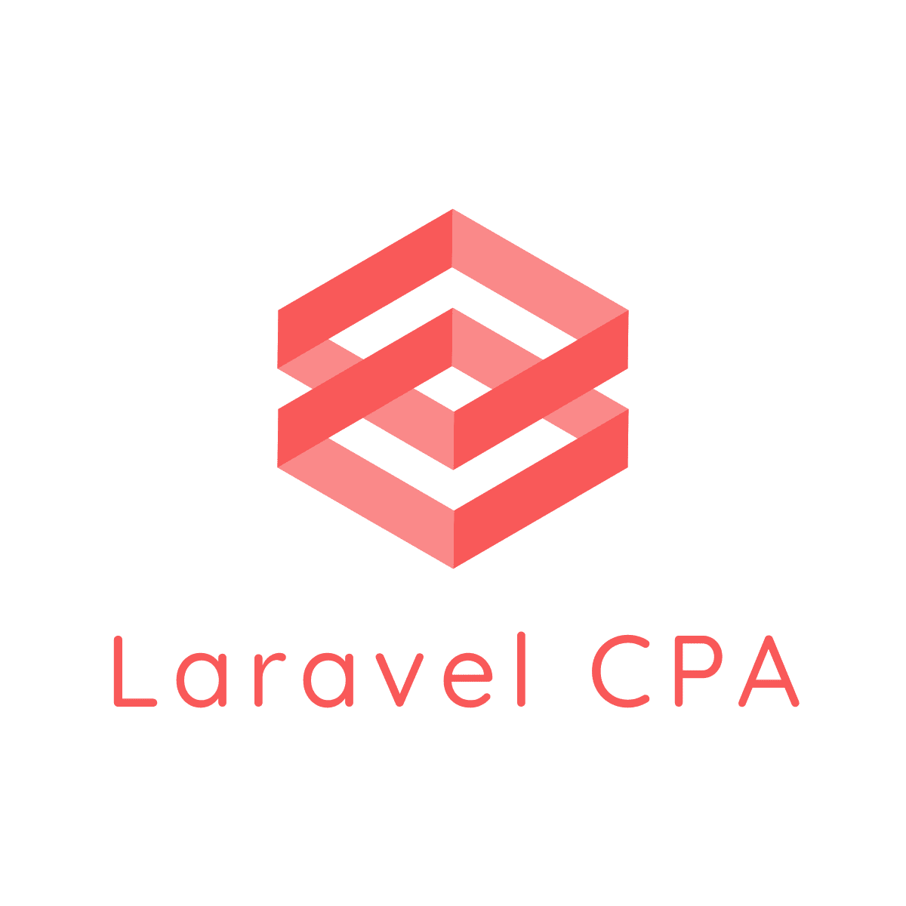

<p align="center">
    
</p>

<p align="center">
    <a href="https://github.styleci.io/repos/401979339"></a>
    <a href="https://packagist.org/packages/arttiger/laravel-cpa"></a>
    <a href="https://packagist.org/packages/arttiger/laravel-cpa"></a>
    <a href="https://packagist.org/packages/arttiger/laravel-cpa"></a>
</p>

Laravel Package for [CPA](https://en.wikipedia.org/wiki/Cost_per_action) networks integration and target customer
actions registration in your application.
Currently supported: [Admitad](https://www.admitad.com/ru/), [Credy](https://www.adcredy.com/),
[DoAffiliate](https://www.doaffiliate.net/), [Finline](https://finline.ua/), [LeadGid](https://leadgid.eu/),
[Leads.su](https://leads.su/), [PapaKarlo](https://papakarlo.com/), [Sales Doubler](https://www.salesdoubler.com.ua/),
[Storm Digital](https://stormdigital.io/), [Loangate](https://loangate.network/), Appscorp,
[PAP](https://squidleads.com/), [GoodAff](https://www.goodaff.com/), [LetMeAds](https://letmeads.com/),
[GuruLeads](https://www.guruleads.ru/), Nolimit.

## Installation

Install the package via composer:

``` bash
$ composer require arttiger/laravel-cpa
```

For Laravel 5.4 and below it necessary to register the service provider

### Configuration

In order to edit the default configuration you may execute:
```
php artisan vendor:publish --provider="Arttiger\Cpa\CpaServiceProvider"
```

After that, `config/cpa.php` will be created.

### Environment
This package can be configured by environment variables out-of-box:

- **SALES_DOUBLER_ID** - personal id for request to SalesDoubler
- **SALES_DOUBLER_TOKEN** - token for request URI for SalesDoubler
- **STORM_DIGITAL_GOAL** - (default: 1), goal in URL for StormDigital
- **STORM_DIGITAL_SECURE** - secure in URL for StormDigital
- **PAPA_KARLO_TYPE** - ('offer' or 'goal') postback type for PapaKarlo
- **PAPA_KARLO_OFFER** - (default: 35) personal offer id for PapaKarlo
- **PAPA_KARLO_GOAL** - (default: 75) personal goal id for PapaKarlo
- **PDL_PROFIT_OFFER** - ID of the advertiser in the PDL-Profit system
- **DO_AFFILIATE_PATH** - path for DoAffiliate API (example: pozichka-ua in http://tracker2.doaffiliate.net/pozichka-ua)
- **LEADS_SU_TOKEN** - token for LeadsSu
- **ADMITAD_POSTBACK_KEY** - postback request authentication key, constant string 32 char
- **ADMITAD_CAMPAIGN_CODE** - AdmitAd defined campaign code, constant string 10 char
- **ADMITAD_ACTION_CODE** - target action code, get it from AdmitAd
- **CREDY_OFFER** - offer code, get it from Credy
- **LET_ME_ADS_PATH** - path for LetMeAds API (example: api/v1.1/y7r/dcfgs1tg:awvv47ghn1jv1f$am/get/postback.json)
- **GURU_LEADS_PATH** - path for GuruLeads API (example: postback)
- **CLICK2MONEY_PATH** - path for Click2Money API (example: cpaCallback)
- **NOLIMIT_PATH** - path for Nolimit API (example: postback)

If one of key for some CPA network not set 
postback requests for this network will not be done. 

### Register Middleware

You may register the package middleware in the `app/Http/Kernel.php` file:

```php
<?php namespace App\Http;

use Illuminate\Foundation\Http\Kernel as HttpKernel;

class Kernel extends HttpKernel {
    /**
    * The application's route middleware.
    *
    * @var array
    */
    protected $routeMiddleware = [
        /**** OTHER MIDDLEWARE ****/
        'lead.check' => \Arttiger\Cpa\Middleware\LeadCheckMiddleware::class
    ];
}
```

You may add middleware to your group like this:

```php
Route::group(
    [
        'middleware' => [ 'lead.check' ]
    ], 
    function(){ //...
});
```

## Usage

Create Lead when user registered
```php
CpaLead::createFromCookie(auth()->user());
// or
CpaLead::createFromCookie($userId);
```

When goal is achieved register conversion 
```php
CpaConversion::register($user, $transactionId, 'sale');
```
Events (e.g. 'sale') **must** be specified in config. You can add additional params for specific events. See `config/cpa.php` samples

## Change log

Please see the [changelog](CHANGELOG.md) for more information on what has changed recently.

## Testing

``` bash
$ composer test
```

## Contributing

Please see [contributing.md](CONTRIBUTING.md) for details and a todolist.

## Security

If you discover any security related issues, please email author email instead of using the issue tracker.

## Credits

[Volodymyr Farylevych](https://github.com/arttiger)

## License

Please see the [license file](LICENSE.md) for more information.
